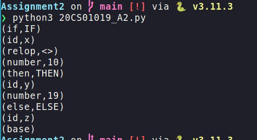

# CDLAB-A2
```
 Name: Aditya Balakrishnan 
 Roll no: 20CS01019
```

### Implementing a lexical analyser:

`Given grammar:`


`Patterns for the grammar:`


--- 
### Description of the code: 
- The program takes two arguments: he input file path and the output file path. The input file contains a list of input statements. The output file will contain the categorized test cases, one per line.

- The program first reads the input file into a string. Then, it calls the buildArray() function to split the string into a list of words. The buildArray() function uses regular expressions to identify keywords, relational operators, numbers, and identifiers. It then adds each word to the list, along with its type.

- The program then calls the categorizeTestCases() function to categorize the test cases. The categorizeTestCases() function loops through the list of words and categorizes each one as a keyword, relop, number, identifier, or unrecognized if it does not match any of the given patterns.

- Finally, the program prints the type of tokens and writes them to the output file. 
---
### Features of the code:
- This program uses the `re` standard library provided by python to work with regular expressions.
- The given regular expressions are compiled into the regex objects using the ```re.compile()``` function.
- These objects can be used to check the input for matching patterns and thus according to the matching, the token type is determined.
---
### Instructions to run the program:

```bash 
git clone git@github.com:adihex/CDLAB-A2.git
cd CDLAB-A2
```
- *Edit the input file as required using your preferred editor:*
<br>

`Eg: if x<>10 then y=19 else z`

```bash
python3 20CS01019_A2.py
```
---
- *The output should be displayed on the console now like below*



---

- *The output is saved in the file **output.txt** also.*

